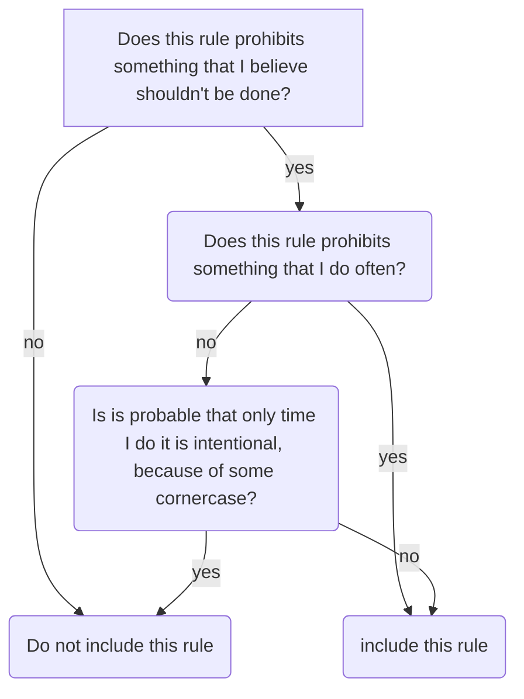

# My personal Eslint config

## Summary

It is a little bit inspired by Airbnb style guide. I ommited rules that I usually not break, because if I break it, I surely means that it is intentional.

### Deciding if rule should be added here

While I'm composing this config I follow simple algorithm to decide if rule should be added here



## Typescript

All rules here are from `@typescript-eslint/...`

### array-type

### explicit-function-return-type

Try to not setup it so it doesn't need type when function is immidiately assigned to some variable.

### member-delimiter-style

### member-ordering

### no-explicit-any

### no-non-null-assertion ?

### prefer-ts-expect-error !

Maybe?

## References

### prefer-const

### no-var

## Objects

### no-new-object

### object-shorthand

To consider — maybe I prefer longer, but consistent syntax? 

Can I configure it in such a way, that methods that are just that – methods – are shorthand, but methods that are values, eg. passed as callbacks etc. are declared with arrow?

Do I have a lot of cases like that to waste time on thinking of that?

### find rule – https://github.com/airbnb/javascript#objects--grouped-shorthand

### quote-props

Do I want it to allow qouting only invalid identifiers, or all?

I prefer to qoute all identifiers if there is at least one invalid identifier in the object, so all identifiers looks the same.

### prefer-object-spread

### object-curly-newline

### object-curly-spacing

## Arrays

### find rule – https://github.com/airbnb/javascript#arrays--bracket-newline

In theory eslint isn't for formatting purposes, but if it works. it works 🤷‍

## Strings

### quotes

Use single qoutes whenever possible. Template literals must contain interpolation or new lines.

### prefer-template

## Functions

### no-loop-func

### prefer-rest-params

### space-before-blocks

### no-param-reassign

### function-paren-newline

multiline

### prefer-arrow-callback

### arrow-parens

## Modules

### import/no-unassigned-import

### import/order

With the `groups` option set to `["builtin", "external", "internal", "parent", "sibling", "index", "object", "type"]` the order is as shown in the following example:

```ts
// 1. node "builtin" modules
import fs from 'fs';
import path from 'path';
// 2. "external" modules
import _ from 'lodash';
import chalk from 'chalk';
// 3. "internal" modules
// (if you have configured your path or webpack to handle your internal paths differently)
import foo from 'src/foo';
// 4. modules from a "parent" directory
import foo from '../foo';
import qux from '../../foo/qux';
// 5. "sibling" modules from the same or a sibling's directory
import bar from './bar';
import baz from './bar/baz';
// 6. "index" of the current directory
import main from './';
// 7. "object"-imports (only available in TypeScript)
import log = console.log;
// 8. "type" imports (only available in Flow and TypeScript)
import type { Foo } from 'foo';
```

## Variables

### no-unused-vars

## Comparison Operators & Equality

### eqeqeq

## Blocks

### brace-style

## Whitespace

### indent

Use tabs

### space-infix-ops

### eol-last

### max-len

### no-trailing-spaces

